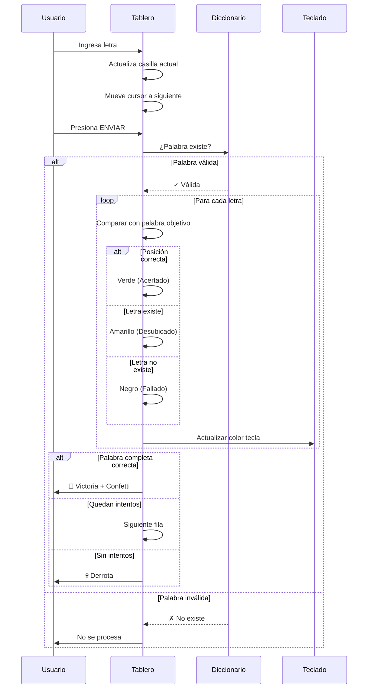
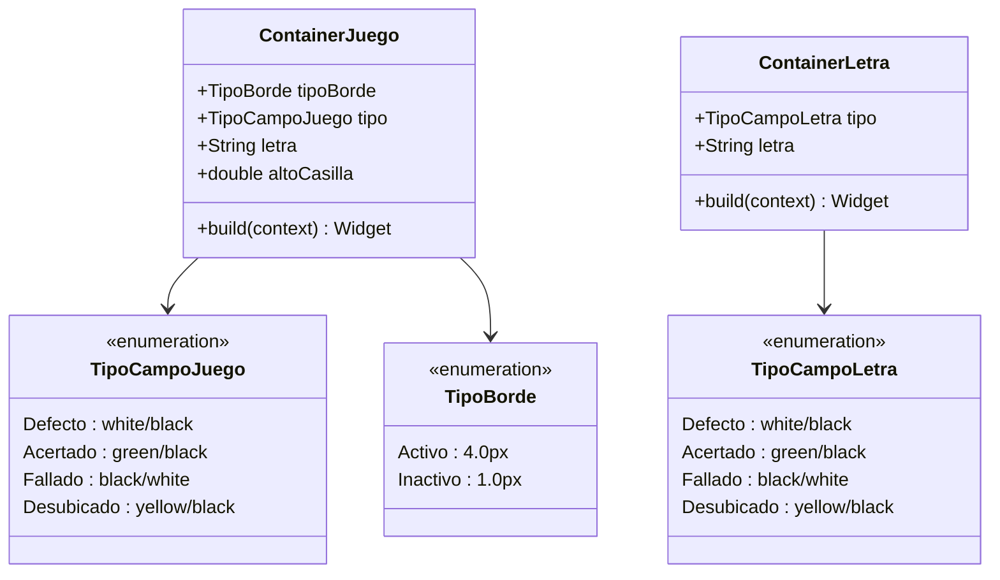
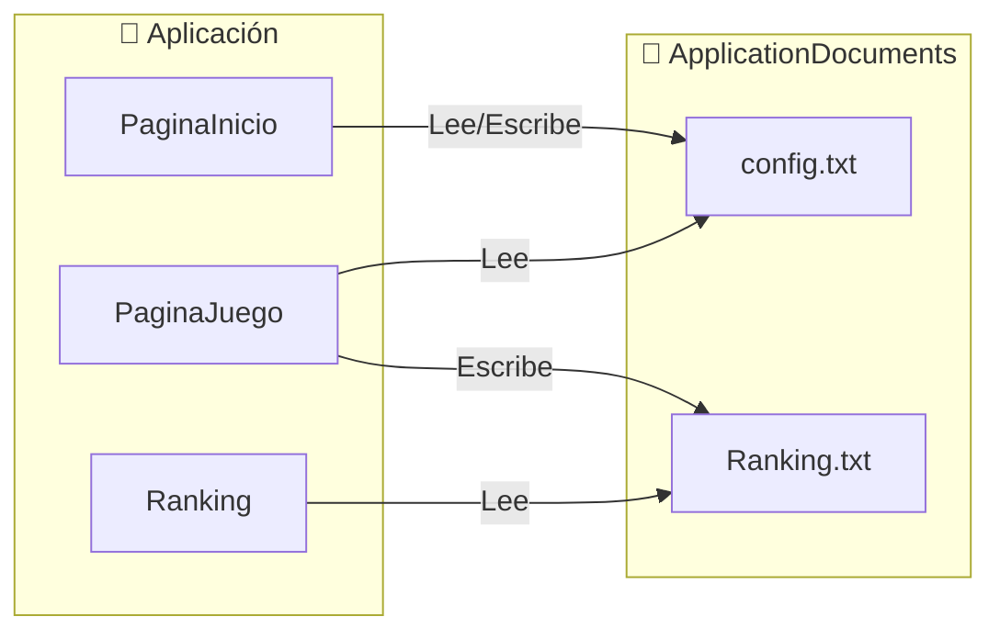
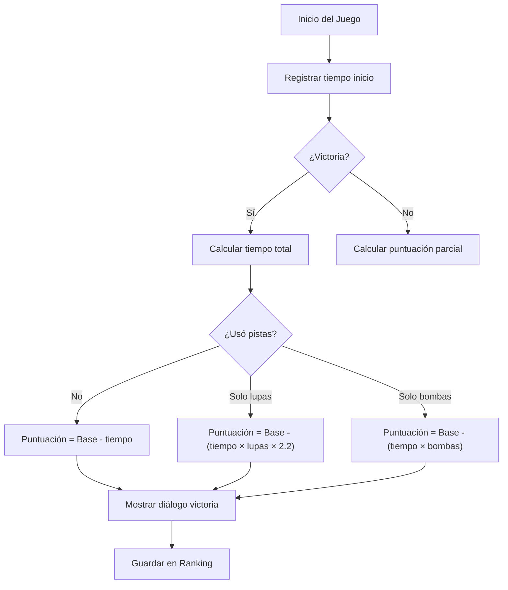

<p align="center">
  
</p>

<h1 align="center">🎮 Wordle Móvil</h1>

<p align="center">
  <strong>Clon multiplataforma del famoso juego de palabras, desarrollado en Flutter</strong>
</p>

<p align="center">
  
  
  
  
  
</p>

<p align="center">
  
  
</p>

---

## 📋 Tabla de Contenidos

- [🎯 El Problema que Resuelve](#-el-problema-que-resuelve)
- [✨ Características Principales](#-características-principales)
- [🔧 Tech Stack](#-tech-stack)
- [🚀 Instalación y Quick Start](#-instalación-y-quick-start)
- [🎲 Lógica del Juego (Core Logic)](#-lógica-del-juego-core-logic)
- [🧩 Estructura de Componentes](#-estructura-de-componentes)
- [🌍 Sistema de Internacionalización](#-sistema-de-internacionalización)
- [💾 Persistencia de Datos](#-persistencia-de-datos)
- [📊 Sistema de Puntuación](#-sistema-de-puntuación)
- [🗂️ Estructura del Proyecto](#️-estructura-del-proyecto)

---

## 🎯 El Problema que Resuelve

**Wordle Móvil** no es simplemente otro clon de Wordle. Es una implementación **multiplataforma nativa** que resuelve las siguientes limitaciones del Wordle original:

| Limitación Original | Solución Implementada |
|---------------------|----------------------|
| Solo una palabra por día | **Palabras ilimitadas** con selección aleatoria del diccionario |
| Un solo idioma (inglés) | **Soporte multiidioma**: Español, Alemán, Italiano |
| Configuración fija (5 letras, 6 intentos) | **Dificultad personalizable**: 4-6 letras, 4-8 intentos |
| Sin sistema de puntuación | **Sistema de ranking** persistente con algoritmo de puntuación |
| Solo web | **6 plataformas nativas**: Android, iOS, Windows, macOS, Linux, Web |
| Sin ayudas | **Sistema de pistas**: Bomba (elimina letras incorrectas) y Lupa (revela una letra) |

---

## ✨ Características Principales

### 🎮 Gameplay
- ✅ Validación de palabras contra diccionarios reales (~9.6 millones de palabras)
- ✅ Feedback visual con código de colores (Verde/Amarillo/Gris)
- ✅ Teclado virtual responsivo con feedback de estado
- ✅ Animaciones de victoria con efecto confetti
- ✅ Sistema de pistas integrado

### ⚙️ Configuración
- ✅ Selección de número de letras: **4, 5 o 6**
- ✅ Selección de intentos: **4, 5, 6, 7 u 8**
- ✅ Cambio de idioma dinámico con persistencia
- ✅ Preferencias guardadas automáticamente

### 🏆 Competitivo
- ✅ Sistema de puntuación algorítmico
- ✅ Ranking local de los 10 mejores jugadores
- ✅ Penalizaciones por uso de pistas y tiempo

---

## 🔧 Tech Stack

### Framework y Lenguaje
| Tecnología | Versión | Propósito |
|------------|---------|-----------|
| **Flutter** | SDK ≥2.19.5 <3.0.0 | Framework de desarrollo multiplataforma |
| **Dart** | ≥2.19.5 | Lenguaje de programación |

### Dependencias de Producción
| Paquete | Versión | Propósito |
|---------|---------|-----------|
| `path_provider` | ^2.0.8 | Acceso al sistema de archivos para persistencia |
| `confetti` | ^0.7.0 | Efectos de confetti en victoria |
| `country_icons` | ^2.0.2 | Iconos de banderas para selector de idioma |
| `cupertino_icons` | ^1.0.2 | Iconos estilo iOS |

### Dependencias de Desarrollo
| Paquete | Versión | Propósito |
|---------|---------|-----------|
| `flutter_test` | SDK | Testing unitario |
| `flutter_lints` | ^2.0.0 | Reglas de estilo de código |

---

## 🚀 Instalación y Quick Start

### Prerrequisitos

```bash
# Verificar instalación de Flutter
flutter doctor

# Versión mínima requerida
flutter --version  # ≥2.19.5
```

### Instalación

```bash
# 1. Clonar el repositorio
git clone https://github.com/tu-usuario/Wordle-Movil.git
cd Wordle-Movil

# 2. Instalar dependencias
flutter pub get

# 3. Ejecutar en modo desarrollo
flutter run
```

### Compilación por Plataforma

<details>
<summary><b>📱 Android</b></summary>

```bash
# APK de debug
flutter build apk --debug

# APK de release
flutter build apk --release

# App Bundle para Play Store
flutter build appbundle
```

</details>

<details>
<summary><b>🍎 iOS</b></summary>

```bash
# Requiere macOS con Xcode instalado
flutter build ios --release

# Abrir en Xcode para signing y deploy
open ios/Runner.xcworkspace
```

</details>

<details>
<summary><b>🪟 Windows</b></summary>

```bash
flutter build windows --release
# Ejecutable en: build/windows/runner/Release/
```

</details>

<details>
<summary><b>🐧 Linux</b></summary>

```bash
flutter build linux --release
# Binario en: build/linux/x64/release/bundle/
```

</details>

<details>
<summary><b>🍏 macOS</b></summary>

```bash
flutter build macos --release
# App en: build/macos/Build/Products/Release/
```

</details>

<details>
<summary><b>🌐 Web</b></summary>

```bash
flutter build web --release
# Archivos estáticos en: build/web/
```

</details>

---

## 🎲 Lógica del Juego (Core Logic)

### Algoritmo de Validación de Palabras

El sistema implementa un algoritmo de validación en tres fases:



### Código de Validación (Simplificado)

```dart
// Fase 1: Verificar existencia en diccionario
if (diccionario.contains(palabraIngresada)) {
  
  // Fase 2: Comparar letra por letra
  for (int i = 0; i < nLetras; i++) {
    if (palabraIngresada[i] == palabraObjetivo[i]) {
      // ✅ Posición correcta → VERDE
      casilla.tipo = TipoCampoJuego.Acertado;
    } else if (palabraObjetivo.contains(palabraIngresada[i])) {
      // 🔶 Existe pero mal posicionada → AMARILLO
      casilla.tipo = TipoCampoJuego.Desubicado;
    } else {
      // ❌ No existe → NEGRO
      casilla.tipo = TipoCampoJuego.Fallado;
    }
  }
}
```

### Sistema de Pistas

El juego incluye dos tipos de ayuda que penalizan la puntuación:

| Pista | Icono | Efecto | Penalización |
|-------|-------|--------|--------------|
| **Bomba** 💣 | `bomba.png` | Elimina una letra incorrecta del teclado | Factor ×1.0 por uso |
| **Lupa** 🔍 | `lupa.png` | Revela una letra correcta en posición aleatoria | Factor ×2.2 por uso |

```dart
// Algoritmo de la Bomba
List<String> clavesExcluidas = [];
for (String clave in mapaTeclado.keys) {
  // Excluir letras de la palabra objetivo
  if (palabra.contains(clave)) clavesExcluidas.add(clave);
  // Excluir letras ya marcadas como fallidas
  if (mapaTeclado[clave].tipo == TipoCampoLetra.Fallado) 
    clavesExcluidas.add(clave);
}
// Seleccionar aleatoriamente una letra no excluida y marcarla
```

---

## 🧩 Estructura de Componentes

### Diagrama de Componentes UI



### Propiedades de Componentes

<details>
<summary><b>ContainerJuego (Casilla del tablero)</b></summary>

| Propiedad | Tipo | Descripción |
|-----------|------|-------------|
| `tipoBorde` | `TipoBorde` | Define si la casilla está activa (borde grueso) o inactiva |
| `tipo` | `TipoCampoJuego` | Estado visual: Defecto, Acertado, Fallado, Desubicado |
| `letra` | `String` | Carácter mostrado en la casilla |
| `altoCasilla` | `double` | Altura dinámica calculada según configuración |

**Estilos visuales:**
- Bordes redondeados (`borderRadius: 12`)
- Sombra 3D (`BoxShadow offset: 2,5`)
- Tamaño de fuente proporcional (`altoCasilla * 0.35`)

</details>

<details>
<summary><b>ContainerLetra (Tecla del teclado)</b></summary>

| Propiedad | Tipo | Descripción |
|-----------|------|-------------|
| `tipo` | `TipoCampoLetra` | Estado visual sincronizado con el tablero |
| `letra` | `String` | Carácter de la tecla |

**Comportamiento:**
- Al presionar, inserta la letra en la casilla activa
- El color se actualiza según los intentos previos
- Las teclas usadas correctamente se mantienen verdes

</details>

---

## 🌍 Sistema de Internacionalización

### Arquitectura de Idiomas

El sistema utiliza un `enum` con metadatos completos para cada idioma:

```dart
enum TipoIdioma {
  espanol(
    "espanol", 
    "assets/diccionarios/espanol.json",  // ~6MB, formato JSON
    "assets/iconos/espana.png",
    "",                                     // Sin separador (JSON)
    "assets/idiomas/espanol.txt",
    null                                    // Sin excepciones
  ),
  aleman(
    "aleman", 
    "assets/diccionarios/aleman.txt",     // ~3MB
    "assets/iconos/alemania.png",
    ";",                                    // Separador punto y coma
    "assets/idiomas/aleman.txt",
    "assets/excepciones/aleman.txt"        // Caracteres a excluir
  ),
  italiano(
    "italiano", 
    "assets/diccionarios/italiano.txt",   // ~560KB
    "assets/iconos/italia.png",
    ";",
    "assets/idiomas/italiano.txt",
    null
  );
}
```

### Tamaño de Diccionarios

| Idioma | Archivo | Tamaño | Formato |
|--------|---------|--------|---------|
| 🇪🇸 Español | `espanol.json` | 6.05 MB | JSON array |
| 🇩🇪 Alemán | `aleman.txt` | 3.04 MB | Texto separado por `;` |
| 🇮🇹 Italiano | `italiano.txt` | 561 KB | Texto separado por `;` |

### Textos de Interfaz

Cada idioma tiene un archivo de traducciones con 11 cadenas separadas por comas:

| Índice | Español | Uso |
|--------|---------|-----|
| 0 | "Número de letras" | Título configuración |
| 1 | "Número de intentos" | Título configuración |
| 2 | "JUGAR" | Botón inicio |
| 3 | "¡GANASTE!" | Modal victoria |
| 4 | "¡PERDISTE!" | Modal derrota |
| 5 | "ENVIAR" | Botón envío |
| 6 | "Puntuación" | Etiqueta |
| 7 | "Tiempo" | Etiqueta |
| 8 | "VOLVER" | Botón navegación |
| 9 | "Introduce tu nombre" | Placeholder input |
| 10 | "La palabra era:" | Texto derrota |

---

## 💾 Persistencia de Datos

El proyecto utiliza almacenamiento local mediante `path_provider`:



### Formato de Archivos

<details>
<summary><b>config.txt</b></summary>

Almacena las preferencias del usuario en formato CSV:

```
espanol;5;6;
```

| Campo | Valor | Descripción |
|-------|-------|-------------|
| 1 | `espanol` | Idioma seleccionado |
| 2 | `5` | Número de letras |
| 3 | `6` | Número de intentos |

</details>

<details>
<summary><b>Ranking.txt</b></summary>

Top 10 jugadores ordenados por puntuación descendente:

```
JugadorPro;1842.50
Campeón;1756.33
Experto;1650.00
...
```

**Lógica de inserción:**
1. Si hay menos de 10 entradas → Insertar siempre
2. Si hay 10 entradas → Insertar solo si supera la puntuación mínima
3. Ordenar por puntuación descendente
4. Eliminar entrada #11 si existe

</details>

---

## 📊 Sistema de Puntuación

### Fórmula de Cálculo

La puntuación se calcula dinámicamente considerando múltiples factores:

```
Puntuación Base = (nLetras × 3) / (nIntentos × 2) × 1000

Penalizaciones:
- Por tiempo: -segundos_transcurridos
- Por lupa: ×2.2 por cada uso
- Por bomba: ×1.0 por cada uso
```

### Ejemplos de Puntuación

| Configuración | Tiempo | Pistas | Cálculo | Puntuación |
|---------------|--------|--------|---------|------------|
| 5 letras, 6 intentos | 45s | Ninguna | (5×3)/(6×2)×1000 - 45 | **1205** |
| 6 letras, 4 intentos | 60s | 1 lupa | (6×3)/(4×2)×1000 - (60×2.2) | **2118** |
| 4 letras, 8 intentos | 30s | 2 bombas | (4×3)/(8×2)×1000 - (30×2) | **690** |

### Diagrama de Flujo de Puntuación



---

## 🗂️ Estructura del Proyecto

```
Wordle-Movil/
├── 📁 lib/                          # Código fuente Dart
│   ├── main.dart                    # Entry point
│   ├── wordle_app.dart              # MaterialApp root
│   ├── pagina_inicio.dart           # Pantalla principal (596 líneas)
│   ├── pagina_juego.dart            # Lógica del juego (884 líneas)
│   ├── ranking.dart                 # Sistema de ranking (200 líneas)
│   ├── container_juego.dart         # Widget casilla (69 líneas)
│   └── container_letra.dart         # Widget tecla (50 líneas)
│
├── 📁 assets/
│   ├── 📁 diccionarios/             # Bases de datos de palabras
│   │   ├── espanol.json             # 6.05 MB
│   │   ├── aleman.txt               # 3.04 MB
│   │   └── italiano.txt             # 561 KB
│   ├── 📁 idiomas/                  # Traducciones UI
│   │   ├── espanol.txt
│   │   ├── aleman.txt
│   │   └── italiano.txt
│   ├── 📁 excepciones/              # Filtros de caracteres
│   │   └── aleman.txt               # Caracteres especiales a excluir
│   └── 📁 iconos/                   # Assets visuales
│       ├── logo.png
│       ├── espana.png
│       ├── alemania.png
│       ├── italia.png
│       ├── bomba.png
│       └── lupa.png
│
├── 📁 android/                       # Configuración Android
├── 📁 ios/                           # Configuración iOS
├── 📁 windows/                       # Configuración Windows
├── 📁 macos/                         # Configuración macOS
├── 📁 linux/                         # Configuración Linux
├── 📁 web/                           # Configuración Web
├── 📁 test/                          # Tests unitarios
│
├── pubspec.yaml                      # Dependencias y metadatos
├── pubspec.lock                      # Versiones exactas
└── analysis_options.yaml             # Reglas de linting
```

---

## 📜 Licencia

Este proyecto está bajo la Licencia MIT. Ver el archivo `LICENSE` para más detalles.

---

## 🤝 Contribuciones

Las contribuciones son bienvenidas. Por favor:

1. Fork el proyecto
2. Crea una rama para tu feature (`git checkout -b feature/NuevaCaracteristica`)
3. Commit tus cambios (`git commit -m 'Añade nueva característica'`)
4. Push a la rama (`git push origin feature/NuevaCaracteristica`)
5. Abre un Pull Request

---

<p align="center">
  Desarrollado con ❤️ y Flutter
</p>
